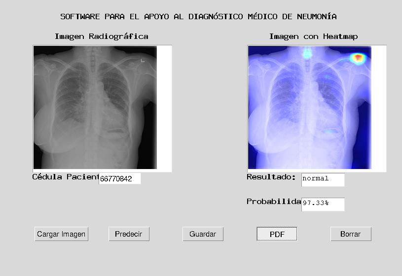
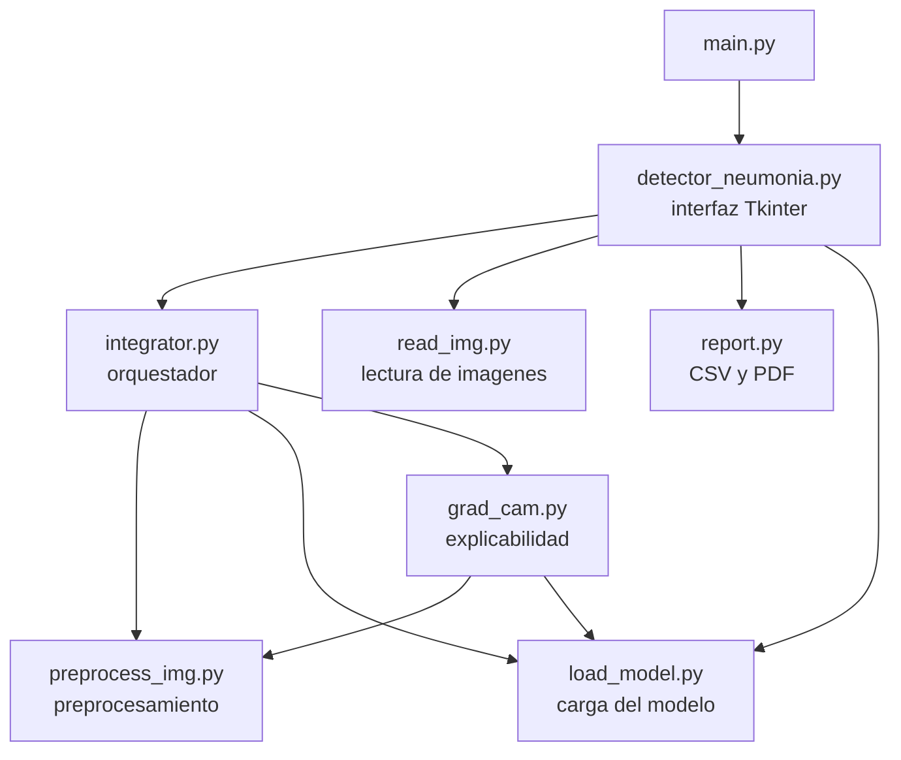
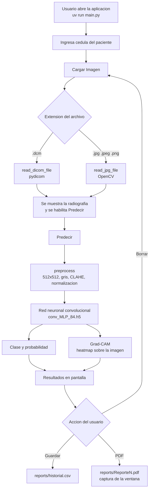
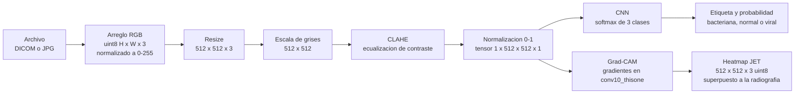
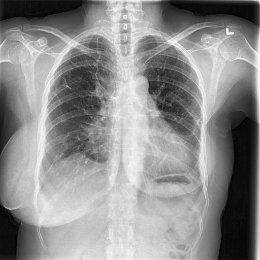

# UAO-Neumonia


Herramienta de apoyo al diagnóstico médico de neumonía mediante Deep Learning. Procesa imágenes radiográficas de tórax (DICOM o JPG/PNG) y las clasifica en tres categorías:

1. Neumonía bacteriana
2. Neumonía viral
3. Sin neumonía (normal)

Incluye Grad-CAM, una técnica de explicabilidad que resalta con un mapa de calor las regiones de la imagen que la red neuronal consideró relevantes para su decisión.



## Tabla de contenidos

- [Requisitos](#requisitos)
- [Instalación](#instalación)
- [Uso](#uso)
- [Pruebas](#pruebas)
- [Docker](#docker)
- [Arquitectura del proyecto](#arquitectura-del-proyecto)
- [Diagrama de proceso](#diagrama-de-proceso)
- [Diagrama de datos](#diagrama-de-datos)
- [Acerca del modelo](#acerca-del-modelo)
- [Acerca de Grad-CAM](#acerca-de-grad-cam)
- [Resultados y limitaciones](#resultados-y-limitaciones)
- [Licencia](#licencia)
- [Créditos](#créditos)

## Requisitos

- [uv](https://docs.astral.sh/uv/): único gestor de entorno y dependencias del proyecto. uv descarga automáticamente Python 3.13 si no está instalado.
- El modelo entrenado `conv_MLP_84.h5` y las imágenes de prueba, que no se versionan en git por su tamaño. Deben ubicarse así:

```
models/conv_MLP_84.h5
data/DICOM/*.dcm
data/JPG/{bacteria,normal,virus}/*.jpeg
```

## Instalación

```bash
git clone https://github.com/yeigen/UAO-Neumonia.git
cd UAO-Neumonia
uv sync
```

`uv sync` crea el entorno virtual `.venv` e instala las versiones exactas fijadas en `uv.lock`. El archivo `requirements.txt` se genera desde ese lock (`uv export --no-dev --no-hashes --format requirements-txt -o requirements.txt`) y se incluye solo como referencia de versiones.

## Uso

### Interfaz gráfica

```bash
uv run main.py
```

1. Ingrese la cédula del paciente en la caja de texto.
2. Presione **Cargar Imagen** y seleccione una radiografía (`.dcm`, `.jpeg`, `.jpg` o `.png`).
3. Presione **Predecir**. La primera predicción tarda unos segundos mientras se carga el modelo; las siguientes son inmediatas.
4. Presione **Guardar** para agregar la cédula, el resultado y la probabilidad a `reports/historial.csv`.
5. Presione **PDF** para generar `reports/ReporteN.pdf` con una captura de la ventana.
6. Presione **Borrar** para limpiar todos los campos y cargar un nuevo caso.

### Scripts de verificación

Cada módulo tiene un script que lo ejercita con las imágenes reales de `data/`:

```bash
uv run python -m scripts.check_read_img
uv run python -m scripts.check_preprocess_img
uv run python -m scripts.check_load_model
uv run python -m scripts.check_grad_cam
uv run python -m scripts.check_integrator
```

`check_integrator` imprime la clasificación de todas las imágenes de muestra; `check_grad_cam` y `check_preprocess_img` guardan las imágenes procesadas en `logs/` para inspección visual.

## Pruebas

```bash
uv run pytest -v
```

La suite usa fixtures sintéticas (archivos DICOM y JPG generados en tiempo de prueba), por lo que corre completa en cualquier máquina sin necesidad del modelo ni de los datos. Las pruebas que validan el modelo real se saltan automáticamente si `models/conv_MLP_84.h5` no existe.

## Docker

Construir la imagen:

```bash
docker build -t uao-neumonia .
```

Ejecutar la interfaz gráfica (Linux, compartiendo la pantalla X11 y montando modelo y datos):

```bash
xhost +local:docker
docker run --rm -e DISPLAY=$DISPLAY \
  -v /tmp/.X11-unix:/tmp/.X11-unix \
  -v ./models:/app/models \
  -v ./data:/app/data \
  uao-neumonia
```

Ejecutar las pruebas dentro del contenedor:

```bash
docker run --rm uao-neumonia uv run pytest -v
```

Ejecutar el pipeline de predicción dentro del contenedor:

```bash
docker run --rm -v ./models:/app/models -v ./data:/app/data \
  uao-neumonia uv run python -m scripts.check_integrator
```

## Arquitectura del proyecto

```
UAO-Neumonia/
├── main.py                  Punto de entrada de la aplicación
├── src/
│   ├── config.py            Constantes y rutas compartidas del proyecto
│   ├── detector_neumonia.py Interfaz gráfica (Tkinter)
│   ├── integrator.py        Orquesta el pipeline y retorna clase, probabilidad y heatmap
│   ├── read_img.py          Lectura de imágenes DICOM y JPG/PNG
│   ├── preprocess_img.py    Redimensión, escala de grises, CLAHE y normalización
│   ├── load_model.py        Carga del modelo entrenado
│   ├── grad_cam.py          Mapa de calor de explicabilidad (tf.GradientTape)
│   └── report.py            Historial CSV y reporte PDF por captura de ventana
├── test/                    Pruebas unitarias (pytest)
├── scripts/                 Verificación manual con imágenes reales
├── reports/                 Historial CSV y reportes PDF generados
├── design/                  Diagramas detallados del diseño del sistema
├── Dockerfile
└── pyproject.toml           Dependencias y configuración (uv)
```

Dependencias entre módulos (cada módulo tiene una única responsabilidad y las flechas son las únicas importaciones entre ellos):



Versión detallada con iconos: [design/architecture-diagram.png](design/architecture-diagram.png)

## Diagrama de proceso

Flujo completo de la herramienta, desde la carga de la imagen hasta los reportes:



Versión detallada con iconos e imágenes: [design/process-diagram.pdf](design/process-diagram.pdf)

## Diagrama de datos

Transformaciones que sufre la imagen a lo largo del pipeline:



Versión detallada con iconos e imágenes: [design/data-diagram.pdf](design/data-diagram.pdf)

El efecto del preprocesamiento y del Grad-CAM sobre una radiografía real:

| CLAHE (entrada de la red) | Grad-CAM (salida explicable) |
|---|---|
|  | .png) |

## Acerca del modelo

El modelo entrenado es `conv_MLP_84.h5`, una red neuronal convolucional basada en la arquitectura propuesta por F. Pasa, V. Golkov, F. Pfeifer, D. Cremers y D. Pfeifer en [Efficient Deep Network Architectures for Fast Chest X-Ray Tuberculosis Screening and Visualization](https://www.nature.com/articles/s41598-019-42557-4).

- Entrada: tensor `(1, 512, 512, 1)` (imagen preprocesada).
- 5 bloques convolucionales con 16, 32, 48, 64 y 80 filtros de 3x3. Cada bloque tiene dos convoluciones secuenciales y una conexión skip que evita el desvanecimiento del gradiente.
- Max pooling tras cada bloque y average pooling tras el último.
- 3 capas densas de 1024, 1024 y 3 neuronas (salida softmax).
- Regularización con 3 capas de Dropout al 20%.
- 9.8 millones de parámetros entrenables.

El modelo se carga con `compile=False` porque fue entrenado con una versión anterior de Keras y su configuración de entrenamiento no es compatible con Keras 3; para inferencia solo se necesitan la arquitectura y los pesos.

## Acerca de Grad-CAM

Grad-CAM calcula el gradiente de la clase predicha respecto a las activaciones de la última capa convolucional (`conv10_thisone`). Con esos gradientes pondera los mapas de activación y obtiene un mapa de calor que indica qué regiones de la radiografía influyeron más en la decisión de la red. El resultado se colorea con el mapa JET y se superpone a la imagen original, dando soporte visual al diagnóstico. La implementación usa `tf.GradientTape` (TensorFlow 2).

## Resultados y limitaciones

Clasificación de las imágenes de muestra con el modelo entrenado:

| Imagen | Clase real | Predicción | Probabilidad |
|---|---|---|---|
| normal (2).dcm | normal | normal | 99.83% |
| normal (3).dcm | normal | normal | 97.33% |
| viral (2).dcm | viral | viral | 95.31% |
| viral (3).dcm | viral | viral | 88.82% |
| person1711_bacteria_4527.jpeg | bacteriana | bacteriana | 54.66% |
| person1710_bacteria_4526.jpeg | bacteriana | viral | 85.37% |

El modelo distingue con alta confianza entre radiografías normales y con neumonía, pero confunde con frecuencia la neumonía bacteriana con la viral, una distinción difícil incluso para especialistas. Esta herramienta es un apoyo al diagnóstico y no sustituye el criterio médico.

## Licencia

Este proyecto se distribuye bajo la licencia MIT. Ver el archivo [LICENSE](LICENSE).

## Créditos

Proyecto original realizado por:

- Isabella Torres Revelo - [isa-tr](https://github.com/isa-tr)
- Nicolas Diaz Salazar - [nicolasdiazsalazar](https://github.com/nicolasdiazsalazar)

Refactorización, corrección de errores, pruebas unitarias y dockerización como proyecto del curso Desarrollo de Proyectos de IA (UAO).
